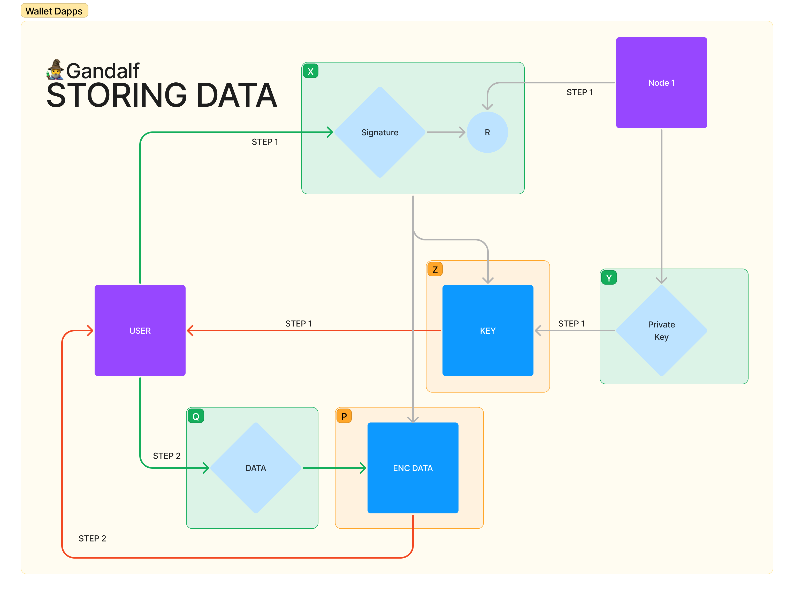

# 🧙‍♂️ Gandalf Protocol 
Gandalf is an innovative protocol layer that provides a highly secure and encrypted way of storing data on the Flow blockchain. Using the advanced AES algorithm and a distributed private key generated on Gandalf's private nodes, a secret encryption key is created to protect users' data.

The key and encrypted data are securely stored in the user's wallet, with the distributed nodes providing the decryption key on request. The user's wallet signature is used to validate the encryption and decryption processes, ensuring maximum security and reliability.

Gandalf's unique storage capabilities make it an ideal solution for Dapps that require secure and efficient data storage on the Flow blockchain. Dapps such as password managers, identity protocols, and databases can be quickly and easily built on top of Gandalf, accelerating development and expanding the FLOW ecosystem.

This is just the beginning of the exciting possibilities that Gandalf opens up for the Flow blockchain. With its robust features and scalability, Gandalf is poised to revolutionize the way Dapps are built and deployed on the Flow network. So join the Gandalf community today and be a part of the future of blockchain technology.

The AssetControl Contract is deployed on Flow Testnet.

# Architecture

# Links
- [Frontend](https://gandalf-protocol.vercel.app/)
- [Backend](https://gandalf-backend-u8mr3.ondigitalocean.app/)
- [Contract](https://flow-view-source.com/testnet/account/0x88d8816248a970ff/contract/AssetControl11)